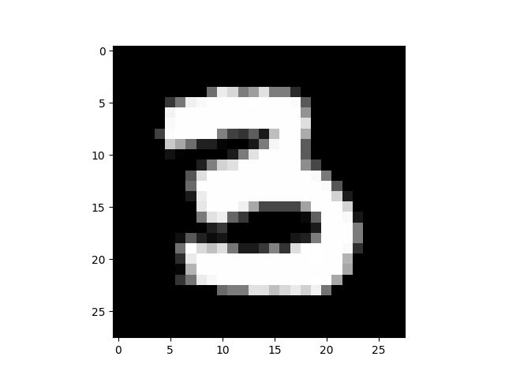
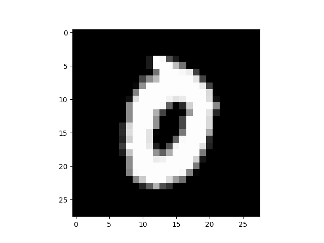
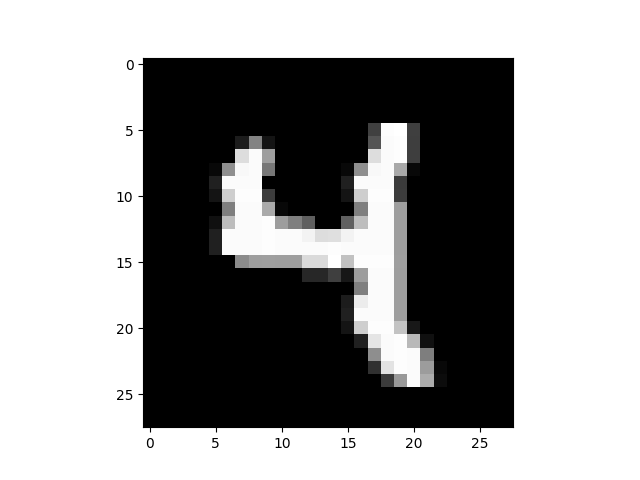
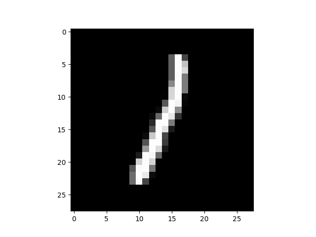
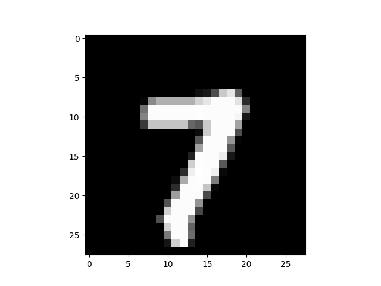

# Neural Network from Scratch (NumPy Only)

In this repo, I implemented a simple neural network from scratch using only Python and NumPy for my learning purposes.  
I implemented it without the use of PyTorch, TensorFlow, or Keras to get a better understanding of the math behind forward and backward propagation.  
I used the classical example of digit recognition using the MNIST dataset.

Dataset link: [Kaggle Digit Recognizer](https://www.kaggle.com/c/digit-recognizer/data)

### **Achieved an accuracy of 86%**

---

### Sample Predictions

#### Prediction: [8]

Label: 8  

#### Prediction: [0]

Label: 6  

#### Prediction: [5]

Label: 6  

#### Prediction: [9]

Label: 9  

#### Prediction: [3]

Label: 3  

#### Prediction: [0]

Label: 0  

#### Prediction: [4]

Label: 4  

#### Prediction: [1]

Label: 1  

#### Prediction: [7]

Label: 7  

---
