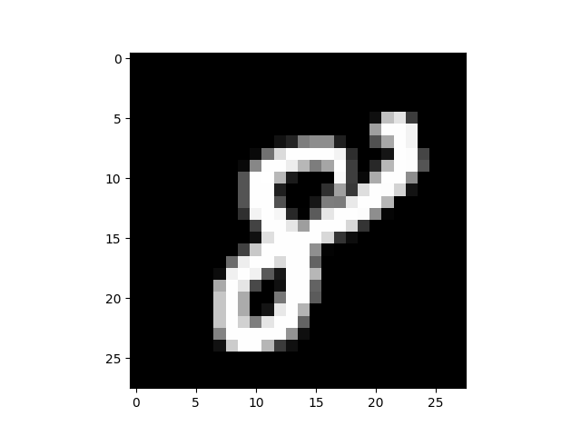
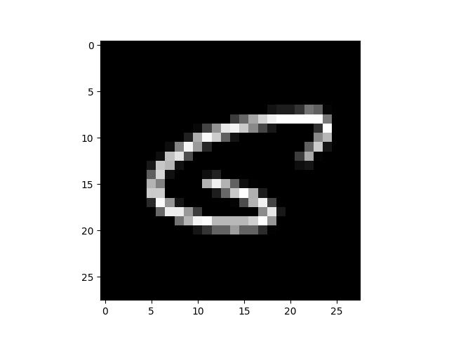
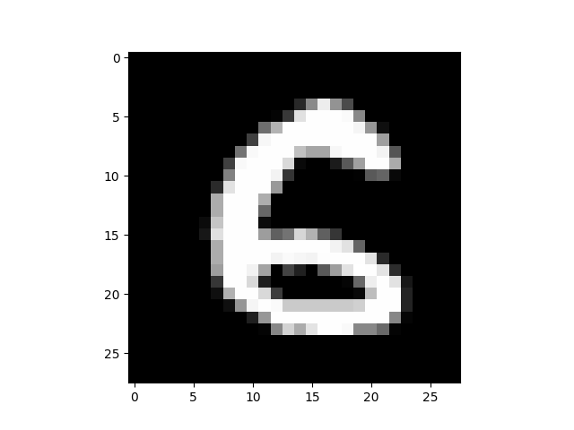
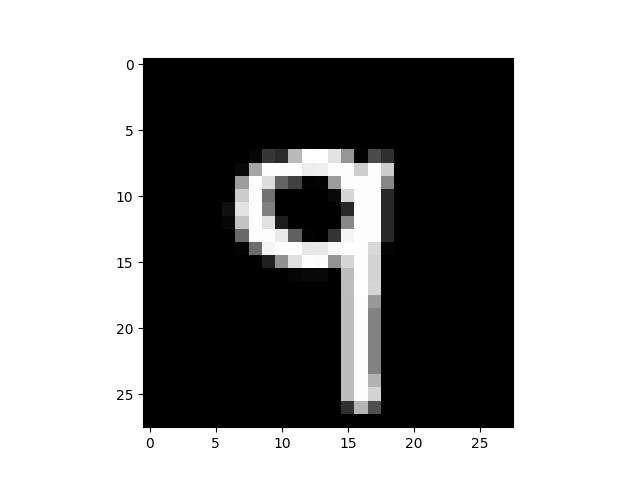

# Neural Network from Scratch (NumPy Only)

In this repo, I implemented a simple neural network from scratch using only Python and NumPy.  
I implemented it without the use of PyTorch, TensorFlow, or Keras to get a better understanding of the math behind forward and backward propagation.  
I used the classical example of digit recognition using the MNIST dataset.

Dataset link: [Kaggle Digit Recognizer](https://www.kaggle.com/c/digit-recognizer/data)

---

### Sample Predictions

#### Prediction: [8]

Label: 8  

#### Prediction: [0]

Label: 6  

#### Prediction: [5]

Label: 6  

#### Prediction: [9]

Label: 9  

---

### **Achieved an accuracy of 85%**
